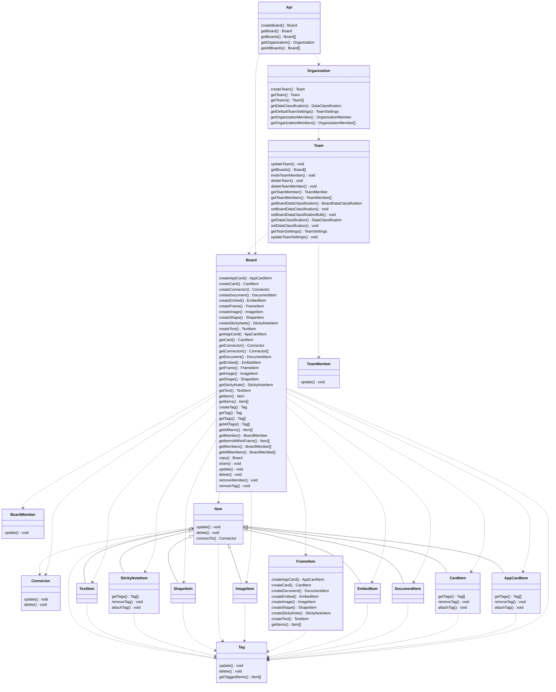

```mermaid
classDiagram
  direction TB

  %% Relationships
  Api ..> Board
  Api ..> Organization
  Board ..> BoardMember
  Board ..> Connector
  Board ..> Item
  Board ..> Tag
  Board ..> AppCardItem
  Board ..> CardItem
  Board ..> DocumentItem
  Board ..> EmbedItem
  Board ..> FrameItem
  Board ..> ImageItem
  Board ..> ShapeItem
  Board ..> StickyNoteItem
  Board ..> TextItem
  AppCardItem ..> Tag
  CardItem ..> Tag
  DocumentItem ..> Tag
  EmbedItem ..> Tag
  FrameItem ..> Tag
  ImageItem ..> Tag
  Item ..> Tag
  Item ..> Connector
  ShapeItem ..> Tag
  StickyNoteItem ..> Tag
  Tag ..> Item
  Team ..> Board
  Team ..> TeamMember
  TextItem ..> Tag
  Organization ..> Team

  %% Items extend generic item
  Item <|--  AppCardItem
  Item <|--  CardItem
  Item <|--  DocumentItem
  Item <|--  EmbedItem
  Item <|--  ImageItem
  Item <|--  ShapeItem
  Item <|--  StickyNoteItem
  Item <|--  TextItem

  %% MUST
  class Api {
    createBoard() Board
    getBoard() Board
    getBoards() Board[]
    getOrganization() Organization
  }

  %% NICE
  class Api {
    getAllBoards() Board[]
  }

  %% MUST
  class Organization {
    createTeam() Team
    getTeam() Team
    getTeams() Team[]
  }

  %% NICE
  class Organization {
    getDataClassification() DataClassification
    getDefaultTeamSettings() TeamSettings
    getOrganizationMember() OrganizationMember
    getOrganizationMembers() OrganizationMember[]
  }

  %% MUST
  class Team {
    updateTeam() void
    getBoards() Board[]
    inviteTeamMember() void
    deleteTeam() void
    deleteTeamMember() void
    getTeamMember() TeamMember
    getTeamMembers() TeamMember[]
  }

  %% NICE
  class Team {
    getBoardDataClassification() BoardDataClassification
    setBoardDataClassification() void
    setBoardDataClassificationBulk() void
    getDataClassification() DataClassification
    setDataClassification() void
    getTeamSettings() TeamSettings
    updateTeamSettings() void
  }

  %% NICE
  class TeamMember {
    update() void
  }

  %% MUST
  class Board {
    createAppCard() AppCardItem
    createCard() CardItem
    createConnector() Connector
    createDocument() DocumentItem
    createEmbed() EmbedItem
    createFrame() FrameItem
    createImage() ImageItem
    createShape() ShapeItem
    createStickyNote() StickyNoteItem
    createText() TextItem
    getAppCard() AppCardItem
    getCard() CardItem
    getConnector() Connector
    getConnectors() Connector[]
    getDocument() DocumentItem
    getEmbed() EmbedItem
    getFrame() FrameItem
    getImage() ImageItem
    getShape() ShapeItem
    getStickyNote() StickyNoteItem
    getText() TextItem
    getItem() Item
    getItems() Item[]
  }

  %% NICE
  class Board {
    createTag() Tag
    getTag() Tag
    getTags() Tag[]
    getAllTags() Tag[]
    getAllItems() Item[]
    getMember() BoardMember
    getItemsWithinFrame() Item[]
    getMembers() BoardMember[]
    getAllMembers() BoardMember[]
    copy() Board
    share() void
    update() void
    delete() void
    removeMember() void
    removeTag() void
  }

  %% NICE
  class BoardMember {
    update() void
  }

  %% MUST
  class Item {
    update() void
    delete() void
  }

  %% NICE
  class Item {
    connectTo() Connector
  }

  %% MUST
  class AppCardItem {
    getTags() Tag[]
    removeTag() void
    attachTag() void
  }

  %% MUST
  class CardItem {
    getTags() Tag[]
    removeTag() void
    attachTag() void
  }

  %% MUST
  class DocumentItem {
  }

  %% MUST
  class EmbedItem {
  }

  %% MUST
  class FrameItem {
  }

  %% NICE
  class FrameItem {
    createAppCard() AppCardItem
    createCard() CardItem
    createDocument() DocumentItem
    createEmbed() EmbedItem
    createImage() ImageItem
    createShape() ShapeItem
    createStickyNote() StickyNoteItem
    createText() TextItem

    getItems() Item[]
  }

  %% MUST
  class ImageItem {
  }

  %% MUST
  class ShapeItem {
  }

  %% MUST
  class StickyNoteItem {
    getTags() Tag[]
    removeTag() void
    attachTag() void
  }

  %% MUST
  class TextItem {
  }

  %% MUST
  class Connector {
    update() void
    delete() void
  }

  %% NICE
  class Tag {
    update() void
    delete() void
    getTaggedItems() Item[]
  }
```
