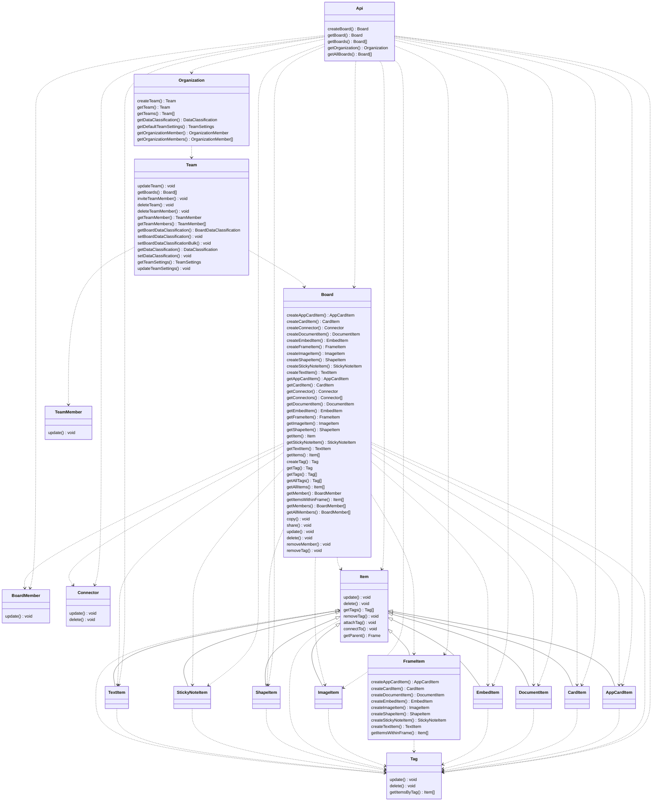

```mermaid
classDiagram
  direction TB

  %% Relationships
  Api ..> Board
  Api ..> BoardMember
  Api ..> Connector
  Api ..> Item
  Api ..> Tag
  Api ..> AppCardItem
  Api ..> CardItem
  Api ..> DocumentItem
  Api ..> EmbedItem
  Api ..> FrameItem
  Api ..> ImageItem
  Api ..> Organization
  Api ..> ShapeItem
  Api ..> StickyNoteItem
  Api ..> TextItem
  Board ..> BoardMember
  Board ..> Connector
  Board ..> Item
  Board ..> Tag
  Board ..> AppCardItem
  Board ..> CardItem
  Board ..> DocumentItem
  Board ..> EmbedItem
  Board ..> FrameItem
  Board ..> ImageItem
  Board ..> ShapeItem
  Board ..> StickyNoteItem
  Board ..> TextItem
  AppCardItem ..> Tag
  CardItem ..> Tag
  DocumentItem ..> Tag
  EmbedItem ..> Tag
  FrameItem ..> Tag
  ImageItem ..> Tag
  Item ..> Tag
  ShapeItem ..> Tag
  StickyNoteItem ..> Tag
  Tag ..> Item
  Team ..> Board
  Team ..> TeamMember
  TextItem ..> Tag
  Organization ..> Team

  %% Items extend generic item
  Item <|--  AppCardItem
  Item <|--  CardItem
  Item <|--  DocumentItem
  Item <|--  EmbedItem
  Item <|--  FrameItem
  Item <|--  ImageItem
  Item <|--  ShapeItem
  Item <|--  StickyNoteItem
  Item <|--  TextItem

  %% MUST
  class Api {
    createBoard() Board
    getBoard() Board
    getBoards() Board[]
    getOrganization() Organization
  }

  %% NICE
  class Api {
    getAllBoards() Board[]
  }

  %% MUST
  class Organization {
    createTeam() Team
    getTeam() Team
    getTeams() Team[]
  }

  %% NICE
  class Organization {
    getDataClassification() DataClassification
    getDefaultTeamSettings() TeamSettings
    getOrganizationMember() OrganizationMember
    getOrganizationMembers() OrganizationMember[]
  }

  %% MUST
  class Team {
    updateTeam() void
    getBoards() Board[]
    inviteTeamMember() void
    deleteTeam() void
    deleteTeamMember() void
    getTeamMember() TeamMember
    getTeamMembers() TeamMember[]
  }

  %% NICE
  class Team {
    getBoardDataClassification() BoardDataClassification
    setBoardDataClassification() void
    setBoardDataClassificationBulk() void
    getDataClassification() DataClassification
    setDataClassification() void
    getTeamSettings() TeamSettings
    updateTeamSettings() void
  }

  %% NICE
  class TeamMember {
    update() void
  }

  %% MUST
  class Board {
    createAppCardItem() AppCardItem
    createCardItem() CardItem
    createConnector() Connector
    createDocumentItem() DocumentItem
    createEmbedItem() EmbedItem
    createFrameItem() FrameItem
    createImageItem() ImageItem
    createShapeItem() ShapeItem
    createStickyNoteItem() StickyNoteItem
    createTextItem() TextItem
    getAppCardItem() AppCardItem
    getCardItem() CardItem
    getConnector() Connector
    getConnectors() Connector[]
    getDocumentItem() DocumentItem
    getEmbedItem() EmbedItem
    getFrameItem() FrameItem
    getImageItem() ImageItem
    getShapeItem() ShapeItem
    getItem() Item
    getStickyNoteItem() StickyNoteItem
    getTextItem() TextItem
    getItems() Item[]
  }

  %% NICE
  class Board {
    createTag() Tag
    getTag() Tag
    getTags() Tag[]
    getAllTags() Tag[]
    getAllItems() Item[]
    getMember() BoardMember
    getItemsWithinFrame() Item[]
    getMembers() BoardMember[]
    getAllMembers() BoardMember[]
    copy() void
    share() void
    update() void
    delete() void
    removeMember() void
    removeTag() void
  }

  %% NICE
  class BoardMember {
    update() void
  }

  %% MUST
  class Item {
    update() void
    delete() void
  }

  %% NICE
  class Item {
    getTags() Tag[]
    removeTag() void
    attachTag() void
    connectTo() void
    getParent() Frame
  }

  %% MUST
  class AppCardItem {
  }

  %% MUST
  class CardItem {
  }

  %% MUST
  class DocumentItem {
  }

  %% MUST
  class EmbedItem {
  }

  %% MUST
  class FrameItem {
  }

  %% NICE
  class FrameItem {
    createAppCardItem() AppCardItem
    createCardItem() CardItem
    createDocumentItem() DocumentItem
    createEmbedItem() EmbedItem
    createImageItem() ImageItem
    createShapeItem() ShapeItem
    createStickyNoteItem() StickyNoteItem
    createTextItem() TextItem

    getItemsWithinFrame() Item[]
  }

  %% MUST
  class ImageItem {
  }

  %% MUST
  class ShapeItem {
  }

  %% MUST
  class StickyNoteItem {
  }

  %% MUST
  class TextItem {
  }

  %% MUST
  class Connector {
    update() void
    delete() void
  }

  %% NICE
  class Tag {
    update() void
    delete() void
    getItemsByTag() Item[]
  }
```
