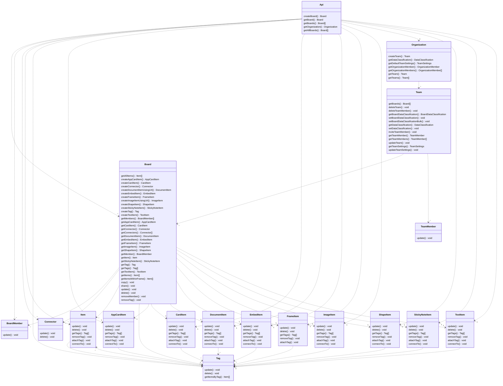

```mermaid
classDiagram
  direction TB

  class Team {
      getBoards() Board[]
  }
  class Board {
      getAllItems() Item[]
  }
  class Api {
      createBoard() Board
      getBoard() Board
      getBoards() Board[]
      getOrganization() Organization
      getAllBoards() Board[]
  }
  class Organization {
      createTeam() Team
      getDataClassification() DataClassification
      getDefaultTeamSettings() TeamSettings
      getOrganizationMember() OrganizationMember
      getOrganizationMembers() OrganizationMember[]
      getTeam() Team
      getTeams() Team[]
  }
  class Team {
      deleteTeam() void
      deleteTeamMember() void
      getBoardDataClassification() BoardDataClassification
      setBoardDataClassification() void
      setBoardDataClassificationBulk() void
      getDataClassification() DataClassification
      setDataClassification() void
      inviteTeamMember() void
      getTeamMember() TeamMember
      getTeamMembers() TeamMember[]
      updateTeam() void
      getTeamSettings() TeamSettings
      updateTeamSettings() void
  }
  class TeamMember {
      update() void
  }
  class Board {
      createAppCardItem() AppCardItem
      createCardItem() CardItem
      createConnector() Connector
      createDocumentItemUsingUrl() DocumentItem
      createEmbedItem() EmbedItem
      createFrameItem() FrameItem
      createImageItemUsingUrl() ImageItem
      createShapeItem() ShapeItem
      createStickyNoteItem() StickyNoteItem
      createTag() Tag
      createTextItem() TextItem
      getMembers() BoardMember[]
      getAppCardItem() AppCardItem
      getCardItem() CardItem
      getConnector() Connector
      getConnectors() Connector[]
      getDocumentItem() DocumentItem
      getEmbedItem() EmbedItem
      getFrameItem() FrameItem
      getImageItem() ImageItem
      getShapeItem() ShapeItem
      getMember() BoardMember
      getItem() Item
      getStickyNoteItem() StickyNoteItem
      getTag() Tag
      getTags() Tag[]
      getTextItem() TextItem
      getItems() Item[]
      getItemsWithinFrame() Item[]
      copy() void
      share() void
      update() void
      delete() void
      removeMember() void
      removeTag() void
  }
  class BoardMember {
      update() void
  }
  class Item {
      update() void
      delete() void
      getTags() Tag[]
      removeTag() void
      attachTag() void
      connectTo() void
  }
  class AppCardItem {
      update() void
      delete() void
      getTags() Tag[]
      removeTag() void
      attachTag() void
      connectTo() void
  }
  class CardItem {
      update() void
      delete() void
      getTags() Tag[]
      removeTag() void
      attachTag() void
      connectTo() void
  }
  class DocumentItem {
      update() void
      delete() void
      getTags() Tag[]
      removeTag() void
      attachTag() void
      connectTo() void
  }
  class EmbedItem {
      update() void
      delete() void
      getTags() Tag[]
      removeTag() void
      attachTag() void
      connectTo() void
  }
  class FrameItem {
      update() void
      delete() void
      getTags() Tag[]
      removeTag() void
      attachTag() void
  }
  class ImageItem {
      update() void
      delete() void
      getTags() Tag[]
      removeTag() void
      attachTag() void
      connectTo() void
  }
  class ShapeItem {
      update() void
      delete() void
      getTags() Tag[]
      removeTag() void
      attachTag() void
      connectTo() void
  }
  class StickyNoteItem {
      update() void
      delete() void
      getTags() Tag[]
      removeTag() void
      attachTag() void
      connectTo() void
  }
  class TextItem {
      update() void
      delete() void
      getTags() Tag[]
      removeTag() void
      attachTag() void
      connectTo() void
  }
  class Connector {
      update() void
      delete() void
  }
  class Tag {
      update() void
      delete() void
      getItemsByTag() Item[]
  }


  Api ..> "*" Board
  Api ..> "*" BoardMember
  Api ..> "*" Connector
  Api ..> "*" Item
  Api ..> "*" Tag
  Api ..> "1" AppCardItem
  Api ..> "1" CardItem
  Api ..> "1" DocumentItem
  Api ..> "1" EmbedItem
  Api ..> "1" FrameItem
  Api ..> "1" ImageItem
  Api ..> "1" Organization
  Api ..> "1" ShapeItem
  Api ..> "1" StickyNoteItem
  Api ..> "1" TextItem
  AppCardItem ..> "*" Tag
  Board ..> "*" BoardMember
  Board ..> "*" Connector
  Board ..> "*" Item
  Board ..> "*" Tag
  Board ..> "1" AppCardItem
  Board ..> "1" CardItem
  Board ..> "1" DocumentItem
  Board ..> "1" EmbedItem
  Board ..> "1" FrameItem
  Board ..> "1" ImageItem
  Board ..> "1" ShapeItem
  Board ..> "1" StickyNoteItem
  Board ..> "1" TextItem
  CardItem ..> "*" Tag
  DocumentItem ..> "*" Tag
  EmbedItem ..> "*" Tag
  FrameItem ..> "*" Tag
  ImageItem ..> "*" Tag
  Item ..> "*" Tag
  ShapeItem ..> "*" Tag
  StickyNoteItem ..> "*" Tag
  Tag ..> "*" Item
  Team ..> "*" Board
  Team ..> "*" TeamMember
  TextItem ..> "*" Tag
  Organization ..> "*" Team
```
