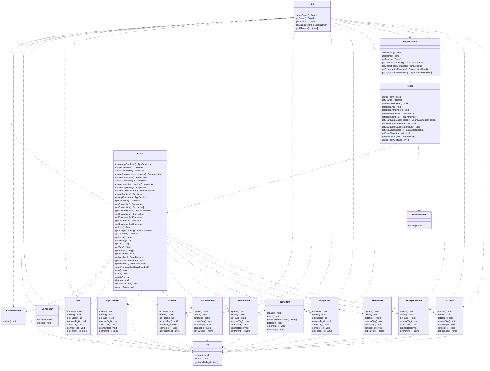

```mermaid
classDiagram
  direction TB

  %% MUST
  class Api {
    createBoard() Board
    getBoard() Board
    getBoards() Board[]
    getOrganization() Organization
  }

  %% NICE
  class Api {
    getAllBoards() Board[]
  }

  %% MUST
  class Organization {
    createTeam() Team
    getTeam() Team
    getTeams() Team[]
  }

  %% NICE
  class Organization {
    getDataClassification() DataClassification
    getDefaultTeamSettings() TeamSettings
    getOrganizationMember() OrganizationMember
    getOrganizationMembers() OrganizationMember[]
  }

  %% MUST
  class Team {
    updateTeam() void
    getBoards() Board[]
    inviteTeamMember() void
    deleteTeam() void
    deleteTeamMember() void
    getTeamMember() TeamMember
    getTeamMembers() TeamMember[]
  }

  %% NICE
  class Team {
    getBoardDataClassification() BoardDataClassification
    setBoardDataClassification() void
    setBoardDataClassificationBulk() void
    getDataClassification() DataClassification
    setDataClassification() void
    getTeamSettings() TeamSettings
    updateTeamSettings() void
  }

  %% NICE
  class TeamMember {
    update() void
  }

  %% MUST
  class Board {
    createAppCardItem() AppCardItem
    createCardItem() CardItem
    createConnector() Connector
    createDocumentItemUsingUrl() DocumentItem
    createEmbedItem() EmbedItem
    createFrameItem() FrameItem
    createImageItemUsingUrl() ImageItem
    createShapeItem() ShapeItem
    createStickyNoteItem() StickyNoteItem
    createTextItem() TextItem
    getAppCardItem() AppCardItem
    getCardItem() CardItem
    getConnector() Connector
    getConnectors() Connector[]
    getDocumentItem() DocumentItem
    getEmbedItem() EmbedItem
    getFrameItem() FrameItem
    getImageItem() ImageItem
    getShapeItem() ShapeItem
    getItem() Item
    getStickyNoteItem() StickyNoteItem
    getTextItem() TextItem
    getItems() Item[]
  }

  %% NICE
  class Board {
    createTag() Tag
    getTag() Tag
    getTags() Tag[]
    getAllTags() Tag[]
    getAllItems() Item[]
    getMember() BoardMember
    getItemsWithinFrame() Item[]
    getMembers() BoardMember[]
    getAllMembers() BoardMember[]
    copy() void
    share() void
    update() void
    delete() void
    removeMember() void
    removeTag() void
  }

  %% NICE
  class BoardMember {
    update() void
  }

  %% MUST
  class Item {
    update() void
    delete() void
  }

  %% NICE
  class Item {
    getTags() Tag[]
    removeTag() void
    attachTag() void
    connectTo() void
    getParent() Frame
  }

  %% MUST
  class AppCardItem {
    update() void
    delete() void
  }

  %% NICE
  class AppCardItem {
    getTags() Tag[]
    removeTag() void
    attachTag() void
    connectTo() void
    getParent() Frame
  }

  %% MUST
  class CardItem {
    update() void
    delete() void
  }

  %% NICE
  class CardItem {
    getTags() Tag[]
    removeTag() void
    attachTag() void
    connectTo() void
    getParent() Frame
  }

  %% MUST
  class DocumentItem {
    update() void
    delete() void
  }

  %% NICE
  class DocumentItem {
    getTags() Tag[]
    removeTag() void
    attachTag() void
    connectTo() void
    getParent() Frame
  }

  %% MUST
  class EmbedItem {
    update() void
    delete() void
  }

  %% NICE
  class EmbedItem {
    getTags() Tag[]
    removeTag() void
    attachTag() void
    connectTo() void
    getParent() Frame
  }

  %% MUST
  class FrameItem {
    update() void
    delete() void
  }

  %% NICE
  class FrameItem {
    getItemsWithinFrame() Item[]
    getTags() Tag[]
    removeTag() void
    attachTag() void
  }

  %% MUST
  class ImageItem {
    update() void
    delete() void
  }

  %% NICE
  class ImageItem {
    getTags() Tag[]
    removeTag() void
    attachTag() void
    connectTo() void
    getParent() Frame
  }

  %% MUST
  class ShapeItem {
    update() void
    delete() void
  }

  %% NICE
  class ShapeItem {
    getTags() Tag[]
    removeTag() void
    attachTag() void
    connectTo() void
    getParent() Frame
  }

  %% MUST
  class StickyNoteItem {
    update() void
    delete() void
  }

  %% NICE
  class StickyNoteItem {
    getTags() Tag[]
    removeTag() void
    attachTag() void
    connectTo() void
    getParent() Frame
  }

  class TextItem {
    %% MUST
    update() void
    delete() void
  }

  %% NICE
  class TextItem {
    getTags() Tag[]
    removeTag() void
    attachTag() void
    connectTo() void
    getParent() Frame
  }

  %% MUST
  class Connector {
    update() void
    delete() void
  }

  %% NICE
  class Tag {
    update() void
    delete() void
    getItemsByTag() Item[]
  }


  Api ..> "*" Board
  Api ..> "*" BoardMember
  Api ..> "*" Connector
  Api ..> "*" Item
  Api ..> "*" Tag
  Api ..> "1" AppCardItem
  Api ..> "1" CardItem
  Api ..> "1" DocumentItem
  Api ..> "1" EmbedItem
  Api ..> "1" FrameItem
  Api ..> "1" ImageItem
  Api ..> "1" Organization
  Api ..> "1" ShapeItem
  Api ..> "1" StickyNoteItem
  Api ..> "1" TextItem
  AppCardItem ..> "*" Tag
  Board ..> "*" BoardMember
  Board ..> "*" Connector
  Board ..> "*" Item
  Board ..> "*" Tag
  Board ..> "1" AppCardItem
  Board ..> "1" CardItem
  Board ..> "1" DocumentItem
  Board ..> "1" EmbedItem
  Board ..> "1" FrameItem
  Board ..> "1" ImageItem
  Board ..> "1" ShapeItem
  Board ..> "1" StickyNoteItem
  Board ..> "1" TextItem
  CardItem ..> "*" Tag
  DocumentItem ..> "*" Tag
  EmbedItem ..> "*" Tag
  FrameItem ..> "*" Tag
  ImageItem ..> "*" Tag
  Item ..> "*" Tag
  ShapeItem ..> "*" Tag
  StickyNoteItem ..> "*" Tag
  Tag ..> "*" Item
  Team ..> "*" Board
  Team ..> "*" TeamMember
  TextItem ..> "*" Tag
  Organization ..> "*" Team
```
